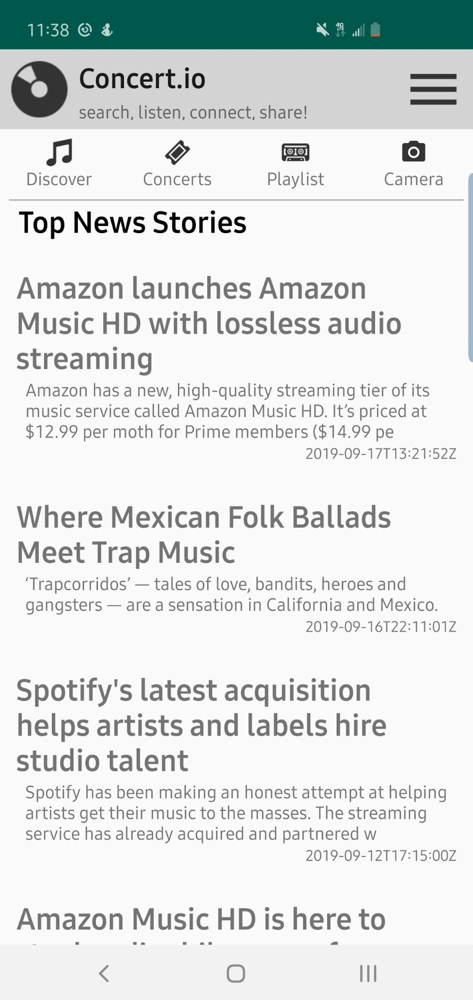

<!----- Conversion time: 0.591 seconds.

Using this Markdown file:

1. Cut and paste this output into your source file.
2. See the notes and action items below regarding this conversion run.
3. Check the rendered output (headings, lists, code blocks, tables) for proper
   formatting and use a linkchecker before you publish this page.

Conversion notes:

* Docs to Markdown version 1.0β17
* Tue Sep 17 2019 10:00:46 GMT-0700 (PDT)
* Source doc: https://docs.google.com/open?id=1EpG37yDX5uJuh_9qay6HnRhZappDDR2v7I26avDcwNs
----->

**Concertio-Android-Application**

---

A news and concert ticket information app designed to help connect users with everything music going on in their area

**Requirements**

---

*   minSdkVersion 26
*   targetSdkVersion 29
*   built in Android Studio 3.4.2

**Features**

---

*   RecyclerViews
*   Adapters
*   Volley in place of AsyncTask
*   Calendar Fragment
*   Spinner
*   Dynamic Api calls
*   Embedded links to Article URLs
*   Camera capabilities
*   Material Design

**Notes**

---

*   Ongoing Project

**Tested**

---

*   Nexus 5 API 26
*   Pixel 2 API 27

**Acknowledgements**

---

*   News provided by newsapi.org
*   Concert ticket information provided by eventful.com

<!-- Docs to Markdown version 1.0β17 -->
